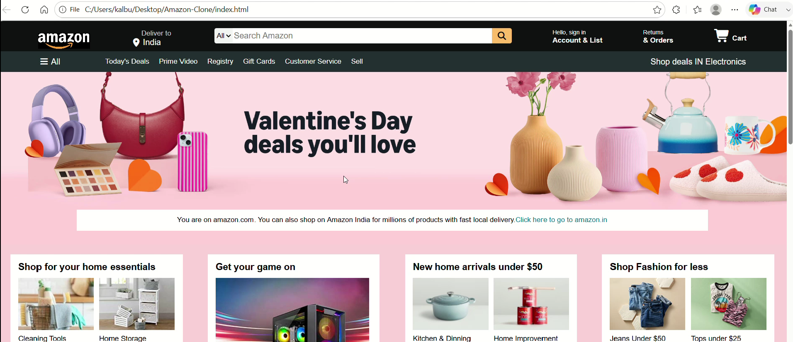

# Amazon_ValentineDay_Clone
## 📌 Project Overview
This project is a front-end clone of the Amazon website built using **HTML5** and **CSS3**.  
It replicates the layout and design of Amazon with a creative **Valentine’s Day theme**.

---

## 🎯 Features
- Responsive homepage layout  
- Amazon-style navigation bar  
- Product sections with images and pricing  
- Hero banner section  
- Footer with multiple links  
- Clean and attractive UI  

---

## 🛠️ Technologies Used
- HTML5  
- CSS3  

---

## 📂 Project Structure

Amazon-Clone/
│── index.html
│── style.css
│── images/


---

## 🚀 How to Run the Project

1. Clone the repository:
```bash
git clone https://github.com/kalburgiakhila/Amazon_ValentineDay_Clone.git
Open the project folder
Run the project:
Open index.html in your browser
📸 Project Demo

[](./amazon.mp4)

🎯 Learning Outcomes
Strong understanding of HTML structure
Improved CSS styling and layout skills
Hands-on experience in building real-world UI
🔮 Future Improvements
Add JavaScript for interactivity
Make it fully responsive
Add cart and login functionality
👩‍💻 Author

Akhila Kalburgi

⭐ Acknowledgement

Inspired by Amazon UI for educational purposes.
